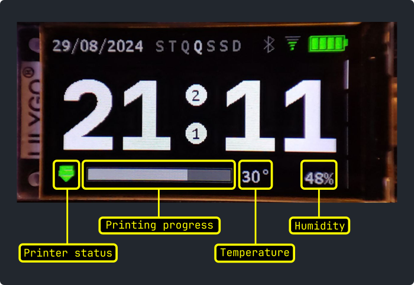

# 🐍 💻 T-Display S3 - Clock + 3D Printer Status

This repository contains Micropython code for the [LilyGO®️ T-Display S3](https://www.lilygo.cc/products/t-display-s3?variant=42284559827125) microcontroller, designed as a clock and 3D printer status monitor. It connects to a Klipper-controlled printer via the Moonraker API to check if the printer is on and display print progress if a job is active. Written entirely in Micropython, it offers a simple and effective way to monitor your 3D printer.


https://github.com/user-attachments/assets/987dc8cc-7281-402b-8b55-590c675abad9




# ⬇️ Download

## The code

First, clone this repository:

```sh
git clone https://github.com/julioformiga/t-display-clock-3d-printer
```

## The firmware

Learn about and download the Micropython firmware with the embedded ST7789 driver from this repo:

[https://github.com/russhughes/st7789s3_mpy](https://github.com/russhughes/st7789s3_mpy)

Download the firmware

```sh
wget https://github.com/russhughes/st7789s3_mpy/raw/main/firmware/firmware.bin
```

# 🧰 Configuration

### Tools
I personally used the [PDM](https://pdm-project.org) package manager primarily to install `esptool` and `mpremote`.

With PDM installed, simply run:

```sh
pdm install
eval $(pdm venv activate)
```
Or with pipx:

```sh
pipx install esptool mpremote
```

### Firmware

With the programs installed, the `firmware.bin` in your `.firmware/` folder, and the T-Display connected via USB in boot mode, run the command to erase the flash:

```sh
esptool.py --port /dev/ttyACM0 erase_flash
```

```sh
esptool.py --port /dev/ttyACM0 write_flash 0 firmware/firmware.bin
```
*Note1: change `/dev/ttyACM0` for your USB device*

*Note2: It is recommended to use ... `write_flash 0x1000 firmware/firmware.bin`, but this didn't work for me.*

### Config Wifi e o IP da 3D printer

Edit the data in `.src/config.py`:

```python
HOSTNAME = "ESP32-TDisplay"
IP_3D_PRINTER = "xxx.xxx.xxx.xxx"
WIFI_SSID = "YOUR-SSID"
WIFI_PASS = "YOUR-PASS"
```

# ⬆️ Upload

To upload the files to the T-Display S3 device, run the `setup.sh` script:

```sh
source setup.sh
```

# 🚧 WIP & OTC (Open To Collab 🤝😁)

It is unlikely to work with just these instructions due to different environments and operating systems.

If you encounter any difficulties, feel free to open an issue or get in touch.
